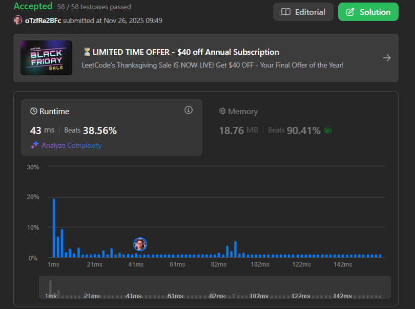
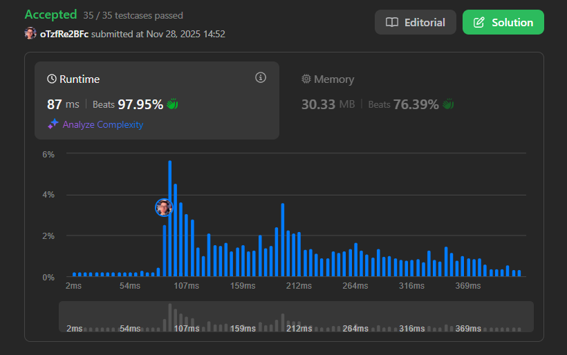

# Programação Dinâmica - LeetCode

**Conteúdo da Disciplina**: Programação Dinâmica (Dynamic Programming)

## Aluno
| Matrícula    | Aluno                           |
| ------------ | ------------------------------ |
| 21/1041221   | LUAN MATEUS CESAR DUARTE       |

## Sobre

Este diretório reúne soluções para problemas de algoritmos de Programação Dinâmica disponíveis na plataforma LeetCode. O objetivo é aplicar técnicas de otimização através da memorização e tabulação, evitando cálculos repetidos e resolvendo subproblemas de forma eficiente, evidenciando o entendimento dos conceitos e técnicas estudados.

## Resumo dos Exercícios

### Exercício 787: Cheapest Flights Within K Stops
Neste exercício, o objetivo é encontrar o voo mais barato de uma origem a um destino com no máximo K paradas. A solução utiliza programação dinâmica baseada no algoritmo de Bellman-Ford, realizando k+1 relaxações para garantir que encontramos o caminho mínimo com a restrição de paradas.

Arquivo: `787.py`

Link para submissão: [LeetCode - 787](https://leetcode.com/problems/cheapest-flights-within-k-stops/submissions/1840235750/?envType=problem-list-v2&envId=dynamic-programming)

---

### 1235: Maximum Profit in Job Scheduling
Neste exercício, o objetivo é maximizar o lucro ao agendar trabalhos que não se sobrepõem. A solução envolve ordenar os trabalhos por tempo de término e usar programação dinâmica para calcular o lucro máximo possível, considerando trabalhos compatíveis.

Arquivo: `1235.py`

Link para submissão: [LeetCode - 1235](https://leetcode.com/problems/maximum-profit-in-job-scheduling/submissions/1841945290/?source=submission-ac)

## Vídeo Explicativo

Link do vídeo: [Vídeo Explicativo]()

## Linguagem Utilizada
Python